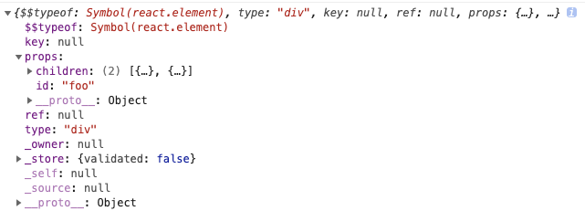

# 二、React 的组件结构

## 1.从`React.createElement`开始

使用`React.createElement`创建如下的 DOM 结构， 代码如下：

```html
<div id="foo">
  <h1>Hello</h1>
  <b />
</div>
```

```javascript
import React from "react";

const element = React.createElement(
  "div",
  {
    id: "foo",
  },
  React.createElement("h1", null, "Hello"),
  React.createElement("b", null, null)
);

console.log(element);
```



## 2.自定义`createElement`

从`React.createElement`的入参和出参可以推测`createElement`存在如下的关键输入和输出结构：

```javascript
function createElement(type, props, ...children) {
  return {
    type,
    props: {
      ...props,
      children,
    },
  };
}
```

在创建 Element 时存在文本类型的 Element 需要特殊处理，于是需要增加一个创建文本元素的方法。由于文本类型的 Element 是 Element 的特例，因此这个方法的输出应该和`createElement`输出结构一致：

```javascript
function createTextElement(text) {
  return {
    type: "TEXT_ELEMENT",
    props: {
      nodeValue: text,
      children: [],
    },
  };
}
```

`createElement`需要判断子节点的数据类型是原始类型还是节点对象。

```javascript
function createElement(type, props, ...children) {
  return {
    type,
    props: {
      ...props,
      children: children.map((child) => (typeof child === "object" ? child : createTextElement(child))),
    },
  };
}
```

有了自定义的`createElement`，用自定义`createElement`替换`React.createElement`。

```javascript
const Didact = {
  createElement,
};

const element = Didact.createElement(
  "div",
  {
    id: "foo",
  },
  Didact.createElement("h1", null, "Hello"),
  Didact.createElement("b", null, null)
);

console.log(element);
```
